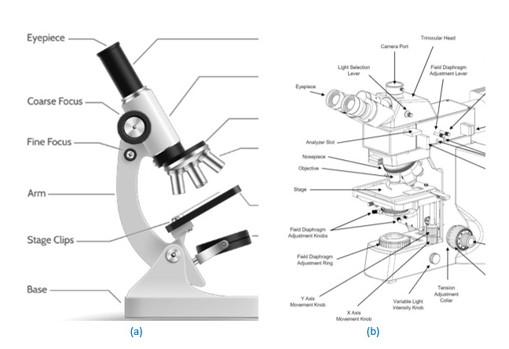

Microscope is the fundamental equipment based on principles of optics to observe the microstructure of a material. As optical wavelengths are utilized to image the polished surface, variations arising due to material processing, heat-treatment, mechanical damage, and service-related aberrations can be captured to quantify the features and compare two material with respect to that of a reference/ideal material. Microscope is a basic tool of observation for metallurgists and materials scientists. Microscope mainly comprises of various part that include: 

(i)	<b>light source</b> (illuminator) to illuminate and brighten the field of view. Light source is very essential to illuminate the sample and permit the capture of reflected light from the surface to be imaged. Without the light source, the image will appear dark (or the illumination from the environment should be of good enough intensity to let it image with respect to background.   

(ii) <b>condenser lens</b> to concentrate light from its source on to the object. Focused light permits enhancing the light intensity, especially at higher magnifications for allowing closely lying features to become visible. Equal intensity light will impart grey or shadow effects and deter capturing a bright image.  

(iii)	<b>objective lens</b> to focus and magnify the features of the sample (and located close to the sample to be observed). Various types of objective lens, say 5×, 10×, 20×, 40×, 50×, and 100×, are typically used. Objective lens is the heart of a microscope. In addition, it is very important that the aberrations (i.e. spherical, chromatic and astigmatism) are minimal in order to capture a focused image.   

(iv)	an <b>eyepiece / ocular</b> (for viewing the image, located close to eye) to enlarge the image formed by the objective lens. This eyepiece may also have reticule, which allows coarse comparison and direct observation of feature size (in a calibrated ocular). Further, the eyepiece may also have additional magnification (typically 10×) that gets multiplied with the magnification of the objective lens, i.e., if objective lens is 50× and eyepiece is 10×, then the total magnification becomes 500×.   

(v)	<b>diopter</b> provide adjustment on eyepiece to allow correct the vision on the eyepiece. Diopter is a corrector for eyepiece, or when the observer removes their spectacles, the diopter allows adjustment to correct the vision.    

(vi)	<b>stage</b> on which the specimen is kept for viewing. The sample stage is important to hold the sample. If the stage is small, then larger samples can not be placed on top. Further, 
the lateral movement also gets hindered. Typically, the stage has a micrometer, which 
can be used to monitor the actual distance travelled (and to track the location of 
features)  

(vii)	<b>base</b> on which the microscope is supported  

(viii)	<b>focus knobs (coarse- and fine-focus knobs)</b> through which the microstructural features are brought to focus for viewing. First, coarse focus is utilized to bring the features in approximate focus. The microscope column moves rapidly during coarse focus and allows easy positioning depending on the sample height (and bring the lenses to near its focal point). Then, fine-focus knob is utilized to perform fine tuning and bringing the sample to the best focus for viewing by observer.   

(ix)	<b>diaphragm / iris<b> is a rotating disc that has varied opening sizes permitting to control (i) <b>aperture diaphragm</b> controls the diameter of light and vary the light intensity as well, and (ii) <b>field diaphragm</b> controls the view of field   

(x)	<b>camera</b> captures the view/image via arrangement of split mirror. Camera permits capturing the features as there may be multiple areas of interest and also multiple magnifications may be needed to observe certain features.  

(xi)	<b>turret/ revolving nosepiece<b> permits changing the magnification among placed objective lenses. Typically a few objective lenses are placed on the turret, which allows moving to different magnifications (to observe the features) without losing the approximate focus region. So the same region can be reached, and fine-focus may bring back the features in focus while being in the same region of interest.   

(xii)	<b>stage clips<b> permit holding the specimen on the sample stage. In order to avoid 
accidental touch and sample movement (in case of not-flat or small samples), stage clips are used to hold the sample in place on sample stage.   

(xiii)	<b>Arm<b> joins the base of microscope to the body tube  

Virtual Reality tool permits observing the exploded view in 3-D rendering to observe how the 
illuminator source provides the light, and how the mirrors direct the travel of light, and how condenser lens brightens the field of view to either go through the sample (biological) or fall on the optically flat sample (opaque/ metallurgical sample) to be picked up by the objective lens to collect and magnify (say ~100×) the features, are focused using focusing knobs (coarse and fine), which eventually are further magnified (say ~10×) by eyepiece to achieve overall magnification (~1000 ×). Thus, a microstructural feature can be magnified and perceived by the observer.    
  
Figure 1: Features of an optical microscope: (a) Biological microscope, where illuminator is below the biological sample to pass through it (Courtesy: www.vedantu.com), and (b) Metallurgical microscope, where the light is reflected from a mirror-polished metallurgical sample (Courtesy: www.greatscopes.com). The specimen is kept on specimen stage, and its features are observed via eyepiece through focusing and magnification achieved by objective lens.   

The fundamentals of lens formula, magnifying power, and types of microscope are already 
covered in the previous experiment.
